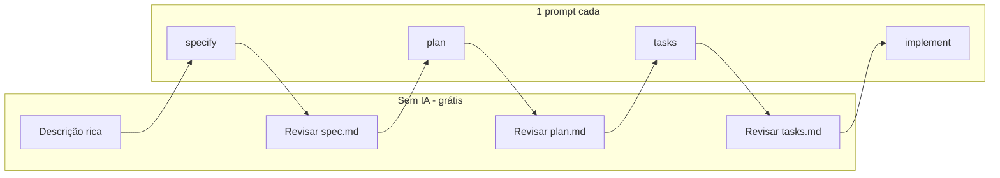

# 01 — Guia completo: SDD com consumo mínimo

## O que é Spec-Driven Development aqui

Você descreve a feature em artefatos versionados:

1. `spec.md` — o quê e por quê (produto, cenários, critérios)
2. `plan.md` — como (stack, estrutura, decisões técnicas)
3. `tasks.md` — o quê fazer, em ordem, com paths de arquivo
4. Implementação guiada por `tasks.md`

No [Spec Kit](https://github.com/github/spec-kit), isso vira comandos `/speckit-specify`, `/speckit-plan`, `/speckit-tasks`, `/speckit-implement` (no Cursor com skills: `/speckit-specify` via skill `speckit-specify`).

## Por que isso reduz requests

| Sem SDD | Com SDD bem feito |
|---------|-------------------|
| Cada chat reexplica o domínio | Constitution + rules carregam domínio |
| Agente explora o repo a cada prompt | `plan.md` e `tasks.md` apontam paths |
| Correções viram novos prompts longos | Você edita o markdown (grátis) |
| Feature grande = muitos chats | Um chat; fatias por Phase |

**Request caro** = novo prompt do usuário ou novo chat.  
**Revisão barata** = abrir `spec.md` no editor e corrigir uma linha.

## Fluxo mínimo (4 prompts por feature)



| # | Prompt | Depois (humano) |
|---|--------|-----------------|
| 1 | `/speckit-specify …` | Ler `spec.md`; corrigir escopo, fora de escopo, cenários |
| 2 | `/speckit-plan` | Ler `plan.md` (+ `data-model.md`); corrigir paths e stack |
| 3 | `/speckit-tasks` | Ler `tasks.md`; paths reais, ordem, marcar o que é MVP |
| 4 | `/speckit-implement` | Testar; se faltou algo → `converge` (opcional) |

## Regras de ouro

1. **Uma feature = um chat** — do specify até o implement no mesmo thread.
2. **Revisão humana entre fases** — editar markdown; não rerodar o comando por ajuste pequeno.
3. **Investir no primeiro prompt** — ator, P1/P2, fora de escopo, 2–5 cenários Given/When/Then.
4. **Pular por padrão:** `clarify`, `analyze`, `checklist` (usar só quando o custo de erro for alto).
5. **Retomar com `converge`**, não recomeçar com `specify`.
6. **Feature grande → 2 specs** (P1 e P2 em pastas distintas) em vez de um `tasks.md` gigante.

## Meta de requests

| Tamanho | Prompts IA | Revisão humana |
|---------|------------|----------------|
| Pequena (1 user story) | 4 | 3 revisões de arquivos |
| Média (2–3 stories) | 4–6 | + fatias de implement no mesmo chat |
| Grande | 5–8 **ou** 2 specs × 4 | Preferir 2 specs separadas |

## O que fazer entre cada fase (checklist)

### Depois do specify

- [ ] User stories com prioridade (P1 = MVP sozinho entrega valor)
- [ ] Fora de escopo explícito
- [ ] Sem `[NEEDS CLARIFICATION]` crítico (ou no máximo 1–2 decididos por você)
- [ ] Critérios de sucesso mensuráveis e sem stack

### Depois do plan

- [ ] Language / Storage / Testing batem com o projeto real
- [ ] Árvore de pastas é a do repo (não “Option 1 / Option 2”)
- [ ] Constitution Check ok (ou violações justificadas)

### Depois do tasks

- [ ] Cada tarefa tem path de arquivo
- [ ] Fases por user story; P1 primeiro
- [ ] Tarefas paralelas marcadas `[P]` só quando arquivos diferentes
- [ ] Você sabe qual Phase é o MVP

### Depois do implement

- [ ] Itens `[X]` em `tasks.md`
- [ ] Testes do projeto verdes
- [ ] Se faltou requisito: `/speckit-converge` **uma vez**, depois `/speckit-implement` de novo

## Retomadas no mesmo chat

```text
Continue a feature em specs/001-slug — implemente a partir da tarefa T007.
```

```text
/speckit-implement — execute somente Phase 3 (User Story 1).
```

Não abra chat novo só porque a sessão ficou longa — use `@specs/001-slug/tasks.md` se o contexto sumiu.

## Comandos opcionais (quando usar)

| Comando | Use quando | Evite quando |
|---------|------------|--------------|
| `clarify` | Spec ambígua e a escolha muda o produto | Você já decidiu no editor |
| `analyze` | Feature multi-módulo / alto risco | Feature pequena |
| `checklist` | Pagamento, permissões, compliance | UI simples |
| `converge` | Implement parou no meio ou faltou escopo | Em vez de novo specify |
| `taskstoissues` | Time vive no GitHub Issues | Solo / preferência por `tasks.md` |

## Próximo

- Diferenças de ferramenta: [02 — Cursor vs Copilot](02-cursor-vs-copilot.md)
- Setup: [04 — Projeto do zero](04-setup-projeto-zero.md)
- Copy-paste: [05 — Prompts prontos](05-prompts-prontos.md)
